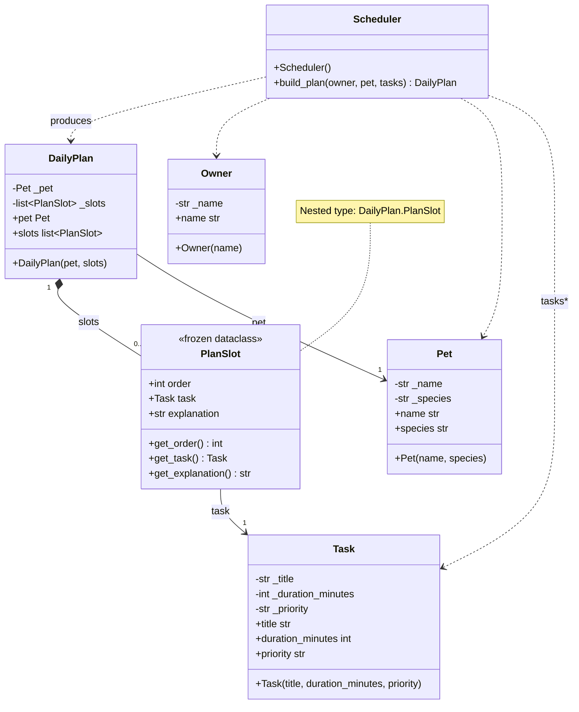

# PawPal+ — domain class diagram (from `plan.md`)

```mermaid
classDiagram
    direction TB

    class Owner {
        -str _name
        +Owner(name)
        +name str
    }

    class Pet {
        -str _name
        -str _species
        +Pet(name, species)
        +name str
        +species str
    }

    class Task {
        -str _title
        -int _duration_minutes
        -str _priority
        +Task(title, duration_minutes, priority)
        +title str
        +duration_minutes int
        +priority str
    }

    class DailyPlan {
        -Pet _pet
        -list~PlanSlot~ _slots
        +DailyPlan(pet, slots)
        +pet Pet
        +slots list~PlanSlot~
    }

    class PlanSlot {
        <<frozen dataclass>>
        +int order
        +Task task
        +str explanation
        +get_order() int
        +get_task() Task
        +get_explanation() str
    }

    class Scheduler {
        +Scheduler()
        +build_plan(owner, pet, tasks) DailyPlan
    }

    DailyPlan "1" *-- "0..*" PlanSlot : slots
    DailyPlan --> "1" Pet : pet
    PlanSlot --> "1" Task : task

    Scheduler ..> DailyPlan : produces
    Scheduler ..> Owner
    Scheduler ..> Pet
    Scheduler ..> Task : tasks*

    note for PlanSlot "Nested type: DailyPlan.PlanSlot"
```
