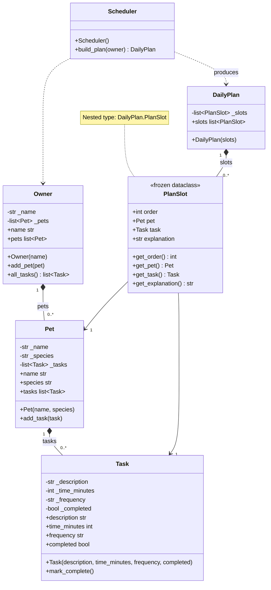

# PawPal+ — domain class diagram (`pawpal_system.py`)

```mermaid
classDiagram
    direction TB

    class Owner {
        -str _name
        -list~Pet~ _pets
        +Owner(name)
        +name str
        +pets list~Pet~
        +add_pet(pet)
        +all_tasks() list~Task~
    }

    class Pet {
        -str _name
        -str _species
        -list~Task~ _tasks
        +Pet(name, species)
        +name str
        +species str
        +tasks list~Task~
        +add_task(task)
    }

    class Task {
        -str _description
        -int _time_minutes
        -str _frequency
        -bool _completed
        +Task(description, time_minutes, frequency, completed)
        +description str
        +time_minutes int
        +frequency str
        +completed bool
        +mark_complete()
    }

    class DailyPlan {
        -list~PlanSlot~ _slots
        +DailyPlan(slots)
        +slots list~PlanSlot~
    }

    class PlanSlot {
        <<frozen dataclass>>
        +int order
        +Pet pet
        +Task task
        +str explanation
        +get_order() int
        +get_pet() Pet
        +get_task() Task
        +get_explanation() str
    }

    class Scheduler {
        +Scheduler()
        +build_plan(owner) DailyPlan
    }

    Owner "1" *-- "0..*" Pet : pets
    Pet "1" *-- "0..*" Task : tasks
    DailyPlan "1" *-- "0..*" PlanSlot : slots
    PlanSlot --> "1" Pet
    PlanSlot --> "1" Task

    Scheduler ..> DailyPlan : produces
    Scheduler ..> Owner

    note for PlanSlot "Nested type: DailyPlan.PlanSlot"
```
